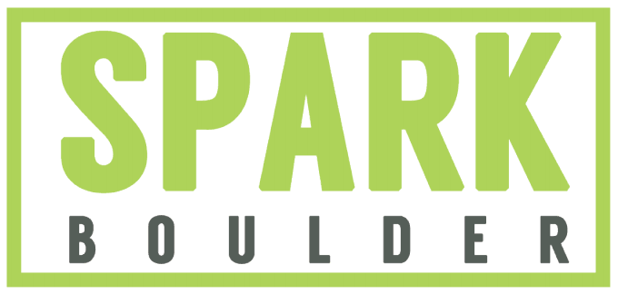

# Front-end Web Development: Syllabus

#### Course Description:
Introductory front-end web development course for students. Does not require prior programming experience.

#### Method of Instruction:
This course will be taught using a lecture/lab format. In class instruction is twice weekly on Monday and Wednesday from 6:30 pm to 8:00 pm at Spark Boulder.

#### Course Key Objectives:
1. Provide an introduction to modern front-end web development.
2. Introduce students to modern tools and professional work flows.
   a. GitHub (Version Control)
   b. Sublime Text (Text Editor/Programming Tool)
   c. Terminal (System tools)
   d. HTML
   e. CSS
   f. JavaScript

#### Course Breakdown (Weekly Schedule):
##### Week 1:
Introduction to github/git, slack, sublime text, terminal, and other related tools. ___Focus___: HTML and CSS, intro to basic JavaScript and jQuery
<em>`Lecture:` 1.5 hours &nbsp;&nbsp; `Lab & Hands-on:` 4.0 hours</em>

##### Week 2:
Jumping into a basic HTML project. An `about me` page. ___Focus___: Getting intimate with HTML and CSS and more exposure to JavaScript
<em>`Lecture:` 2.0 hours &nbsp;&nbsp; `Lab & Hands-on:` 4.0 hours</em>

##### Week 3:
Building a landing page. ___Focus___: Wire-framing, UX process, HTML, CSS, JavaScript
<em>`Lecture:` 3.0 hours &nbsp;&nbsp; `Lab & Hands-on:` 6.0 hours</em>

##### Week 4:
Let's build a mini-blogging framework. ___Focus___: Server Administration (FTP), HTTP, WWW, HTML, CSS, JavaScript
<em>`Lecture:` 3.0 hours &nbsp;&nbsp; `Lab & Hands-on:` 8.0 hours</em>

##### Week 5:
Let's learn JavaScript. ___Focus___: Variables, Types, Operators, Objects, Arrays, Conditionals, Expressions
<em>`Lecture:` 3.0 hours &nbsp;&nbsp; `Lab & Hands-on:` 7.0 hours</em>

##### Week 6:
Let's learn JavaScript. ___Focus___: Loops, Functions, Lexical Scope, Hoisting, Execution Context, BOM, DOM
<em>`Lecture:` 3.0 hours &nbsp;&nbsp; `Lab & Hands-on:` 7.0 hours</em>

##### Week 7:
Let's learn JavaScript. ___Focus___: Intro to Advanced OOP JavaScript (closures, callbacks, scope, more...)
<em>`Lecture:` 3.0 hours &nbsp;&nbsp; `Lab & Hands-on:` 7.0 hours</em>

##### Week 8:
Working with API's: Let's build a SPA. `Quote of the day` APP. ___Focus___: API's, HTML, CSS, JavaScript/jQuery
<em>`Lecture:` 3.0 hours &nbsp;&nbsp; `Lab & Hands-on:` 8.0 hours</em>

##### Week 9:
_Student's choice project:_ Pick a local business and create a simple static website (5 page max). `Project: Practicing the basics` ___Focus___: HTML, CSS, UX Design, Wire-framing, JavaScript/jQuery
<em>`Lecture:` 1.5 hours &nbsp;&nbsp; `Lab & Hands-on:` 8.0 hours</em>

##### Week 10:
Student professional portfolio page. Showcase your work. ___Focus___: HTML, CSS, UX Design, Wire-framing, JavaScript/jQuery
<em>`Lecture:` 3.0 hours &nbsp;&nbsp; `Lab & Hands-on:` 10.0 hours</em>

#### Required Reading and Tutorials (Additional Resources):
1. **HTML**
   a. HTML and CSS code tracks: [Codecademy](https://www.codecademy.com/tracks/web)
   b. Make a website: [Codecademy](https://www.codecademy.com/skills/make-a-website)
   c. HTML documentation: [MDN/Mozilla HTML](https://developer.mozilla.org/en-US/docs/Web/HTML)

2. **CSS**
   a. CSS: Coding with style: [Codecademy](https://www.codecademy.com/courses/css-coding-with-style/0/1)
   b. CSS documentation: [MDN/Mozilla CSS](https://developer.mozilla.org/en-US/docs/Web/CSS)
   c. Learn CSS Basics: [Basic CSS](http://www.cssbasics.com)
   d. CSS-Tricks: [CSS Blog](https://css-tricks.com/)

3. **JavaScript**
   a. The fundamentals of JavaScript: [Codecademy](https://www.codecademy.com/tracks/javascript)
   b. JavaScript documentation: [MDN/Mozilla JS](https://developer.mozilla.org/en-US/docs/Web/JavaScript/Reference)

4. **Git**
   a. Git Tutorial: [CodeSchool/Try Git](https://try.github.io/levels/1/challenges/1)
   b. Git man pages: [Git/Manual](https://git-scm.com/documentation)
   c. Cheat sheet: [GitHub](https://training.github.com/kit/downloads/github-git-cheat-sheet.pdf)

5. **Terminal**
   a. Learn basic terminal commands game: [MIT](http://web.mit.edu/mprat/Public/web/Terminus/Web/main.html) 
   b. Cheat sheet 1: [ss64](http://ss64.com/osx/)
   c. Cheat sheet 2: [GitHub/OSX Cheat Sheet](https://github.com/0nn0/terminal-mac-cheatsheet/wiki/Terminal-Cheatsheet-for-Mac-(-basics-))
